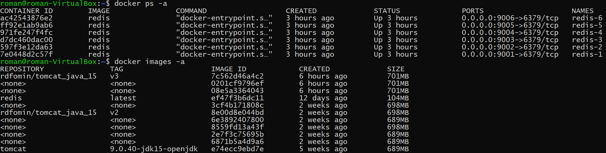
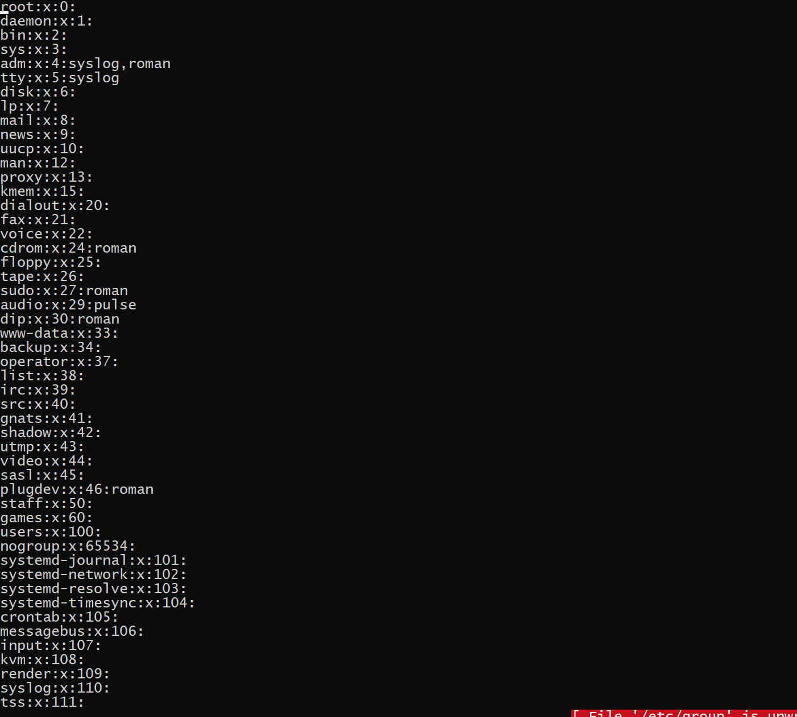
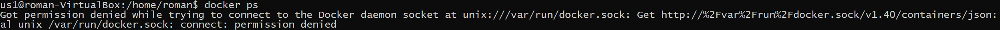

# linux-lab-3
## Часть 1
### Добавление пользователей
Вводим следующие команды для создания пользователей:
sudo useradd -d /home/us1 -s /bin/bash us1
sudo useradd -d /home/us2 -s /bin/bash us2
sudo useradd -d /home/us3 -s /bin/bash us3
Получим:

### Добавление паролей
Добавляем пользователям пароли. Результат выполнения команд:

### Добавление группы admin.
Добавления позьлователей us1, us2 и root в группу admin следующими командами:
sudo groupadd admin
sudo usermod -aG admin us1
sudo usermod -aG admin us2
sudo usermod -aG admin root
Результаты:

#### Удостовериться в этом введением команд.

Реализация запрета всем пользователям, кроме группы admin, логин в систему по SSH в выходные дни
Устанавливаем pam_script командой sudo apt install libpam-script.
Создаем файл /usr/share/libpam-script/pam_script_acct, и пишем в нем код:

Далее выполняем команду sudo chmod +x /usr/share/libpam-script/pam_script_acct:

## Часть 2
##### Для установки докера были выполнены команды:
`sudo apt update && sudo apt upgrade`
`sudo apt install apt-transport-https ca-certificates curl software-properties-common`
`curl -fsSL https://download.docker.com/linux/ubuntu/gpg | sudo apt-key add -`
`sudo add-apt-repository "deb [arch=amd64] https://download.docker.com/linux/ubuntu bionic stable"`
`sudo apt update && apt-cache policy docker-ce`
`sudo apt install -y docker-ce`
##### Выдача прав пользователю roman производилась командой:
`sudo usermod -aG docker roman`
Чтобы пользовать мог пользоваться основными командами docker'a необходимо установить пакет docker compose, для этого необходимо выполнить следующие команды:
`sudo curl -L "https://github.com/docker/compose/releases/download/1.25.0/docker-compose-$(uname -s)-$(uname -m)" -o /usr/local/bin/docker-compose`
`sudo chmod +x /usr/local/bin/docker-compose`
Попробуем выполнить команды работы с docker'ом:

Для того, чтобы пользователь мог пользоваться docker необходимо его дабавить в группу docker. В файле /etc/groups можно посмотерть у каких пользователей есть права на использование docker.

Попробуем воспользоваться docker от имени позльователя us1

